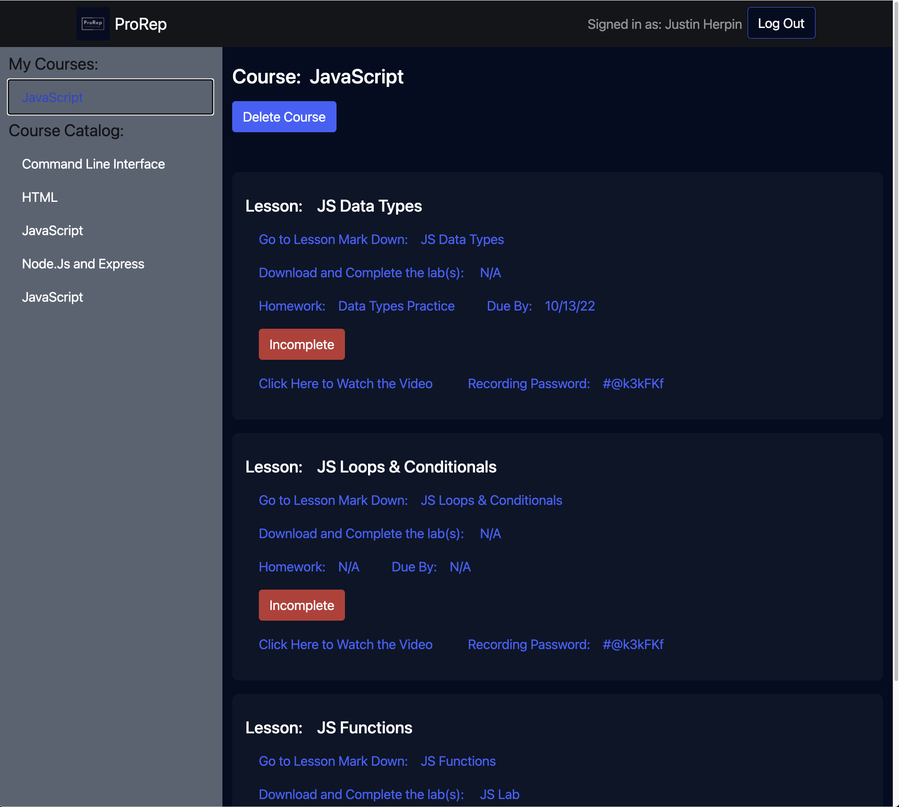

# GA_Project_4_ProRep

Progress Report (ProRep) seeks to be a simple course/class/homework tracker for GA Students, adaptable for future updates to allow for more complex admin course additions/updates and grading/full project or course tracking for teachers, students, and parents to keep information up to date in real time.

<!--
*** Thanks for checking out the Best-README-Template. If you have a suggestion
*** that would make this better, please fork the repo and create a pull request
*** or simply open an issue with the tag "enhancement".
*** Don't forget to give the project a star!
*** Thanks again! Now go create something AMAZING! :D
-->

<!-- PROJECT SHIELDS -->
<!--
*** I'm using markdown "reference style" links for readability.
*** Reference links are enclosed in brackets [ ] instead of parentheses ( ).
*** See the bottom of this document for the declaration of the reference variables
*** for contributors-url, forks-url, etc. This is an optional, concise syntax you may use.
*** https://www.markdownguide.org/basic-syntax/#reference-style-links
-->

<!-- [![Contributors][contributors-shield]][contributors-url]
[![Forks][forks-shield]][forks-url]
[![Stargazers][stars-shield]][stars-url]
[![Issues][issues-shield]][issues-url]
[![MIT License][license-shield]][license-url]
[![LinkedIn][linkedin-shield]][linkedin-url] -->

<!-- PROJECT LOGO -->
 

  

  <h3 align="center">Justin Herpin's ProRep App</h3>

  

    GA seirFlex-928 Project #4
     
    <a href="https://prorep-frontend.herokuapp.com/"><strong>Try ProRep Now</strong></a>
     
     
    <a href="https://www.linkedin.com/in/justin-herpin-ba5a8a217/">My Linked In</a>
    ·
    <a href="https://github.com/JustinDHerpin?tab=repositories">My Personal GitHub Repositories</a>
    ·
    <a href="https://github.com/JustinDHerpin/frontend_GA_P4_ProRep">This Project's Front-End Repository</a>
    ·
    <a href="https://github.com/JustinDHerpin/backend_GA_P4_ProRep">This Project's Back-End Repository</a>

  

<!-- ABOUT THE PROJECT -->

## About The Project

General Assembly has been great for quickly getting us (myself and my cohort) up to speed with the most in-demand programming languages, frameworks, technologies, and libraries...but there was always somthing a little clunky about the GoogleDocs Course schedule, which is where all lessons, labs, recordings, recording passwords, etc exist for the students to interact with. The basics were all there, but there was no way to see if a homework had been graded without going through our emails, or if a lab was finished or not just by looking at the course schedule without having to go back and open your lab folder and manually checking, or even locate resources without having to go through slack, navigating to the resources channel and scrolling through till you (maybe) find the resource you are looking for.

This slight inconvenience was the inspiration for my app, ProRep (shortened from ProgressReport). My idea was to consolidate all this information into one single place, allowing students to view their homeworks, whether they had completed it or not and if it had been accepted by instructors as complete as well, and to group important resources together in a single place, locatable from within the lesson(s) to which they are relevant. Also, to provide searchability to the application that would allow for quick access to this information.

My initial goal was to have most of these features implemented, but as we are only given 2 weeks for the project, I focused in on creating a basic version. Students can look through a list of courses available (provided through seed data at this time), add this course to their courses, view their added courses, delete from their courses (but not the course list itself), and update whether they have completed a homework (or not...).

So...with that being said, this is the beginning, version 1 edition of my concept. With my continued experience, I will continue to add features and fine-tune this app until it models what I think will be an incredible teaching and monitoring tool for teachers, instructors, professors, students, and parents, allowing for earlier detection if their student(s) begin falling behind (instead of the old-school version of waiting for progress reports or report cards sent from school once it's too late), and to identify areas that can be improved upon to better set their child/student/loved one up for success in the future by keeping them on track in real-time today, when it will help the most.

## ProRep - Images from the app:

(<a href="#top">back to top</a>)

### Technologies and Other Packages Utilized:

- [HTML](https://html.com/)
- [CSS](https://www.w3schools.com/w3css/defaulT.asp)
- [JavaScript](https://www.javascript.com/)
- [Node.js](https://nodejs.org/en/)
- [Express](https://expressjs.com/)
- [React](https://reactjs.org/docs/getting-started.html)
- [React Bootstrap](https://react-bootstrap.github.io/)
- [Bootstrap](https://getbootstrap.com/)
- [MongoDB Atlas](https://www.mongodb.com/cloud/atlas/lp/try2?utm_content=1217adtest_pmcopy_control&utm_source=google&utm_campaign=gs_americas_united_states_search_core_brand_atlas_desktop&utm_term=mongodb%20atlas&utm_medium=cpc_paid_search&utm_ad=e&utm_ad_campaign_id=12212624338&adgroup=115749704063&gclid=CjwKCAiA55mPBhBOEiwANmzoQg3l7zg3gvFhAbD53-XikqCKuC8UBjfNuS5EMa_X4aqD3caTtMiBmBoCUywQAvD_BwE) - Used in Deployment
- [Mongoose](https://mongoosejs.com/)
- [bcrypt](https://www.npmjs.com/package/bcrypt)
- [JWT](https://jwt.io/)
- [Redux](https://redux.js.org/)
- [React Redux](https://react-redux.js.org/)
- [dotenv](https://www.npmjs.com/package/dotenv)

### Frequented References:

- All Links Above Plus:
- [W3Schools](https://www.w3schools.com/)
- [MDN Web Docs](https://developer.mozilla.org/en-US/)
- [Google](https://www.google.com/)
- [YouTube](https://www.youtube.com/)
- [Pixabay - royalty free pictures](https://pixabay.com/)

(<a href="#top">back to top</a>)

<!-- GETTING STARTED -->

## How To Download Git Hub Repository and Setup Locally:

- [Click here or above to visit this project's front-end repository](https://github.com/JustinDHerpin/frontend_GA_P4_ProRep)
- [Click here or above to visit this project's back-end repository](https://github.com/JustinDHerpin/backend_GA_P4_ProRep)
- Make a new directory in your terminal to clone the files into - i.e. "mkdir prorep" - or decide where you want the files to be installed.
- CD into your new directory or chosen folder - i.e. "cd imbibed"
- Once you are in your new directory, click on the 'fork' button at the top-right of the page. --Do this for each repository, front-end and back-end.
- Once you are redirected to your forked copy, copy the URL and paste it into your terminal where you are already in the directory created or chosen in the previous steps. The syntax should be: "git clone https://www.yourforkedcopy.com", and press enter to clone the files into your directory.--Do this for each repository, front-end and back-end.
- Once the process is completed, use code . to open with VSCode, or open with your chosen editor and run "npm init" and "npm install" to install all dependencies for this project's front end. cd into your backend folder and type/run "npm init" and "npm install" to install dependencies, then run "node courseSeedsMVP.js", to start out with some data, then nodemon to start up your backend server.
- Once the process is completed, to run the project locally, open up a new browser window and navigate to the site "localhost:3000/", which will take you to the login/home page.

- Or, if developing isn't your thing and you just want to check it out,you can [Click Here](https://prorep-frontend.herokuapp.com/) to open the public version available from heroku.com.

(<a href="#top">back to top</a>)

<!-- LICENSE -->

## User Stories and Stretch Goals

MVP Goals:

-As a user, I would like to see a list of all the different classes/subjects/units I am taking.
-As a user, I would like the ability to click on an entry and be presented with data about the subject.
-As a user, I would like the ability to easily add a new subject to the list.
-As a user, I would like the ability to remove a subject from the list.
-As a user, I would like the ability to edit or change information to each entry as my education continues

StretchGoals:

-As a user, I would like to be able to log in to a profile that has subjects and assignments unique to me.
-As a user, I would like to be able to search for a subject or homework
-As a user, I would like to have a "Due" list of assignments that are due soon, like a Todo page that lists upcoming important dates.
-As a user, I would like to be able to see other students' posted resources for the subject.
-As a user, I would like to enjoy a professional, attractive UI.
-As a user, I would like to be able to see the names of other cohort members.
-As a user, I would like to be able to email or chat with my professors or other cohort members from the interface.
-As a user, I would like to be able to receive feedback on my portal about assignments and pass/fail

## Biggest Challenges and Unresolved Problems/Issues:

- Initial Strategy/Planning - We were supposed to incorporate 1 new technology we weren't taught as a topic in class...I chose 3: redux, JWT, and Bootstrap. While initially everything was ok, I quickly realized that redux was going to take a minute to really understand well enough to know what was going on, and when to use redux for state vs useState. Also, initially I went with many models, all with relationships to one another for homeworks, courses, labs, lessons, courses originally having their own schemas...managing this along with trying out new file structure-destructuring was too much and ended up having to scale back what I thought was going to be my MVP.

- REDUX - Redux was pretty easy to set up at first with tutorials, but as I progressed throgh my project and began to deviate, adapt to my project from the tutorial, and then to adding my own reducers entirely and linking them up to work correctly was a huge time suck.

- React - It took me a while to get re-acquainted with react after going through python in the weeks before and controlling state/how everything worked, which made understanding redux more difficult and vice-versa.

- Getting my main components to re-render correctly

## What I Learned and Takeaways:

- Biggest thing I think as far as node and express goes was gaining a lot more familiarity with models, views, controllers, routes, syntax, middleware and it's many roles, abilities and functionality through breaking them apart (the file structure) more than I had in the past.
- Finally getting back in the groove with CSS and Boostrap. Practice with styling is something I definitely needed and still need more of in the future.
- Time Management and importance of a solid initial strategy- as always, things took me much longer than initially planned for, which hindered my progress towards the end of the project.

(<a href="#top">back to top</a>)

<!-- CONTACT -->

## Contact

MyName: Justin D. Herpin

My Email: justindherpin@yahoo.com

Git Hub Front-End Project Link: [https://github.com/JustinDHerpin/frontend_GA_P4_ProRep](https://github.com/JustinDHerpin/frontend_GA_P4_ProRep)

Git Hub Back-End Project Link: [https://github.com/JustinDHerpin/backend_GA_P4_ProRep](https://github.com/JustinDHerpin/backend_GA_P4_ProRep)

Deployed Project Link: [https://prorep-frontend.herokuapp.com/](https://prorep-frontend.herokuapp.com/)

(<a href="#top">back to top</a>)

<!-- ACKNOWLEDGMENTS -->

## License

Distributed under the MIT License. See `LICENSE.txt` for more information.

(<a href="#top">back to top</a>)

- [Choose an Open Source License](https://choosealicense.com)
- [GitHub Emoji Cheat Sheet](https://www.webpagefx.com/tools/emoji-cheat-sheet)
- [Malven's Flexbox Cheatsheet](https://flexbox.malven.co/)
- [Malven's Grid Cheatsheet](https://grid.malven.co/)
- [Img Shields](https://shields.io)
- [GitHub Pages](https://pages.github.com)
- [Font Awesome](https://fontawesome.com)
- [React Icons](https://react-icons.github.io/react-icons/search)

(<a href="#top">back to top</a>)

<!-- MARKDOWN LINKS & IMAGES -->
<!-- https://www.markdownguide.org/basic-syntax/#reference-style-links -->

[contributors-shield]: https://img.shields.io/github/contributors/othneildrew/Best-README-Template.svg?style=for-the-badge
[contributors-url]: https://github.com/othneildrew/Best-README-Template/graphs/contributors
[forks-shield]: https://img.shields.io/github/forks/othneildrew/Best-README-Template.svg?style=for-the-badge
[forks-url]: https://github.com/othneildrew/Best-README-Template/network/members
[stars-shield]: https://img.shields.io/github/stars/othneildrew/Best-README-Template.svg?style=for-the-badge
[stars-url]: https://github.com/othneildrew/Best-README-Template/stargazers
[issues-shield]: https://img.shields.io/github/issues/othneildrew/Best-README-Template.svg?style=for-the-badge
[issues-url]: https://github.com/othneildrew/Best-README-Template/issues
[license-shield]: https://img.shields.io/github/license/othneildrew/Best-README-Template.svg?style=for-the-badge
[license-url]: https://github.com/othneildrew/Best-README-Template/blob/master/LICENSE.txt
[linkedin-shield]: https://img.shields.io/badge/-LinkedIn-black.svg?style=for-the-badge&logo=linkedin&colorB=555
[linkedin-url]: https://linkedin.com/in/othneildrew
[product-screenshot]: images/screenshot.png
